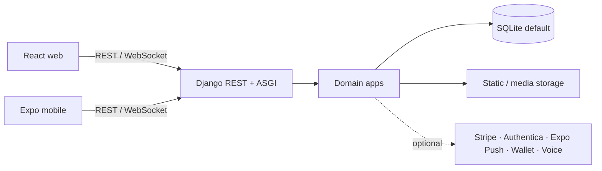

# CafeMS

CafeMS is a full-stack cafe-management and ordering platform with a Django API, React web client, and Expo mobile client. This repository is a sanitized portfolio copy intended for employer review and technical evaluation.

CafeMS هو نظام متكامل لإدارة المقهى والطلبات، يتكون من API مبني على Django وواجهة ويب مبنية على React وتطبيق هاتف مبني على Expo. هذه النسخة منقحة ومخصصة لعرض الأعمال والمراجعة التقنية.

> **Portfolio scope / نطاق نسخة العرض:** Production credentials, operational databases, customer records, private uploads, deployment identifiers, and private business contact details are intentionally excluded. See [NOTICE.md](NOTICE.md) and [docs/SECURITY.md](docs/SECURITY.md).

## English

### Overview

CafeMS brings catalog management, ordering, point-of-sale workflows, inventory, invoices, loyalty, customer support, HR, and accounting into one modular application. The codebase includes separate browser and mobile clients backed by a shared Django REST/ASGI service.

### Key features

- Product categories, subcategories, products, add-ons, and menu import tooling.
- Customer registration, JWT login/refresh, password reset, email/phone verification, addresses, and permissions.
- Ordering, order items, table/POS workflows, status history, inventory adjustments, dashboard statistics, and public order tracking.
- Invoice records with PDF, barcode, and QR-related generation code.
- Payment methods and Stripe checkout/webhook flows configured through environment variables.
- Authenticated and guest support conversations, rule-based bot handling, staff actions, voice-message paths, and WebSocket consumers.
- Loyalty profiles, transactions, scanning, and Apple/Google wallet-pass flows when certificates are configured.
- HR workflows for employees, attendance, leave, contracts, payroll, documents, reports, and notifications.
- Accounting workflows for chart of accounts, journal entries, suppliers, banking, expenses, purchases, assets, tax records, inventory transactions, and reports.
- Responsive React web dashboards and an RTL-aware bilingual Expo mobile experience.

### System architecture



The current Django settings use SQLite by default and `channels.layers.InMemoryChannelLayer` for WebSockets. Docker Compose also provisions PostgreSQL and Redis services, but they are not wired into the default settings in this checkout; the distinction is documented in [docs/ARCHITECTURE.md](docs/ARCHITECTURE.md).

### Technology stack

| Area | Technologies found in the project |
| --- | --- |
| Web | React 18, TypeScript, Vite, Tailwind CSS, React Router, Axios, Framer Motion, Recharts |
| Mobile | React Native, Expo SDK 54, React Navigation, TanStack React Query, SecureStore/AsyncStorage, WebView |
| Backend | Django 5.2.8, Django REST Framework, SimpleJWT, Django Channels, Daphne, django-filter, django-cors-headers |
| Data | SQLite by default; migrations are included. Compose provisions PostgreSQL, but the current settings do not select it. |
| Infrastructure | Dockerfiles, Docker Compose, ASGI/WSGI entry points |
| Optional services | Stripe, Authentica OTP, Expo Push, Apple/Google Wallet, OpenAI/Whisper, ElevenLabs |

### Main modules

The backend is divided into `accounts`, `products`, `orders`, `invoices`, `payments`, `support`, `hr`, `accounting`, `loyalty`, `store`, `contact`, and `core`. This separation keeps customer identity, commerce, operational workflows, support, people operations, finance, and store configuration in distinct Django apps.

### Authentication and authorization

The custom `accounts.User` model is used with SimpleJWT access and refresh tokens. The API exposes current-user, verification, address, role-permission, activity, and push-token flows. DRF authentication, throttling, serializers, and application-level permission checks protect dashboard, HR, accounting, and operational endpoints.

### API architecture

The API is grouped under `/api/auth/`, `/api/products/`, `/api/orders/`, `/api/invoices/`, `/api/contact/`, `/api/support/`, `/api/payments/`, `/api/hr/`, `/api/store/`, `/api/loyalty/`, and `/api/accounting/`. Health checks are available at `/health/` and `/api/health/`. Realtime routes are `ws/support/<conversation_id>/` and `ws/orders/<user_id>/`. See [docs/API.md](docs/API.md).

### Database design

The schema is represented by Django models and migrations. Important entity groups include users and permissions; product catalogs and add-ons; orders, tables, items, and inventory; invoices and payment transactions; support conversations and messages; loyalty profiles and transactions; employees and HR records; accounting journals and reports; and store settings. No database file or real record is included in this repository.

### Engineering highlights

- Domain-oriented Django app boundaries with shared REST patterns.
- A single backend serving both a React web client and an Expo mobile client.
- JWT-based account flows combined with guest support verification paths.
- Operational workflows spanning order status, POS tables, inventory, invoices, HR, and accounting.
- ASGI routing for support and order updates, with a clearly documented local in-memory channel-layer boundary.
- Environment-driven integration points for payments, OTP, notifications, voice, and wallet passes.
- Bilingual/RTL-aware client presentation and reusable store-branding configuration.

### Screenshots and media

The repository retains only generic menu imagery reviewed for visible private information.


### Project structure

```text
backend/      Django project, domain apps, migrations, tests, Dockerfile
frontend/     React + TypeScript + Vite web client
mobile/       React Native + Expo mobile client
menu/         Generic menu manifest and reviewed sample imagery
docs/         Architecture, API, and security documentation
docker-compose.yml
NOTICE.md
```

### Local development

The following commands reflect the checked-in scripts and configuration. Use PowerShell or adapt the activation command for another shell.

```powershell
# Backend
Set-Location backend
python -m venv .venv
.\.venv\Scripts\Activate.ps1
pip install -r requirements.txt
Copy-Item .env.example .env
python manage.py check
python manage.py migrate
python manage.py runserver
```

```powershell
# Web client, in another terminal
Set-Location frontend
npm install
Copy-Item .env.example .env.local
npm run dev
```

```powershell
# Mobile client
Set-Location mobile
npm install
Copy-Item .env.example .env
npm run typecheck
npm start
```

For the containerized shape, copy both backend and frontend examples to the `.env` paths expected by Compose, then run `docker compose up --build`. A physical mobile device needs a LAN-reachable API/socket host instead of `localhost`.

### Environment variables

Use [backend/.env.example](backend/.env.example), [frontend/.env.example](frontend/.env.example), and [mobile/.env.example](mobile/.env.example). They contain variable names and local placeholders only. Payment, OTP, push, wallet, voice, and email integrations remain unconfigured until values are supplied locally.

### Database setup

The default settings create a local SQLite database at `backend/db.sqlite3`, which is ignored. Run `python manage.py migrate` to create a clean schema. Do not copy a production or backup database into this checkout.

### Testing and checks

Backend tests are present in `backend/apps/support/tests.py`, `backend/apps/contact/tests.py`, `backend/apps/hr/tests.py`, and `backend/apps/accounting/tests/test_journal.py`.

```powershell
Set-Location backend
python manage.py check
python manage.py test

Set-Location ..\frontend
npm run build

Set-Location ..\mobile
npm run typecheck
```

### Security notes

This is a sanitized showcase repository. Environment files, credentials, operational databases, deleted database backups, exports, private uploads, local editor state, build output, temporary files, and deployment-specific identifiers are excluded. Keep all real values in a secret manager or ignored local files, and review the full reachable history before every future publication.

### Portfolio notice

This repository is derived from a private development/production codebase and is provided for viewing and technical evaluation; see [NOTICE.md](NOTICE.md).

### Author

Author: Ramazan Alkhalil <contact@ronnidev.com>

## العربية

### نبذة عن المشروع

CafeMS نظام متكامل لإدارة المقهى والطلبات، يجمع إدارة القائمة والطلبات ونقاط البيع والمخزون والفواتير والولاء والدعم والموارد البشرية والمحاسبة في تطبيق واحد. توجد واجهة ويب وتطبيق هاتف يعتمدان على خدمة Django مشتركة.

### المشكلة التي يحلها النظام

يوحد النظام دورة العمل من عرض المنتجات وتلقي الطلب، مرورًا بتحديث الحالة ونقاط البيع والمخزون والفاتورة، إلى دعم العميل والتقارير والعمليات الداخلية. وهو يقسم هذه المسؤوليات إلى وحدات واضحة يمكن تقييمها وتطويرها بشكل مستقل.

### المميزات الرئيسية

- إدارة التصنيفات والمنتجات والإضافات وأدوات استيراد القائمة.
- تسجيل المستخدمين وتسجيل الدخول عبر JWT واستعادة كلمة المرور والتحقق من البريد والهاتف والعناوين والصلاحيات.
- الطلبات والعناصر والطاولات ونقاط البيع وسجل الحالات وتعديلات المخزون وإحصاءات اللوحة والتتبع العام للطلب.
- سجلات الفواتير مع كود إنشاء PDF والباركود وQR.
- طرق الدفع وتدفقات Stripe عبر متغيرات البيئة.
- محادثات دعم موثقة وضيف، وبوت قائم على القواعد، وإجراءات الموظفين، ورسائل صوتية واتصالات WebSocket.
- ملفات ومعاملات الولاء والمسح وتدفقات بطاقات المحفظة عند توفير الشهادات.
- وحدات الموظفين والحضور والإجازات والعقود والرواتب والوثائق والتقارير والإشعارات.
- دليل الحسابات والقيود والموردون والحسابات البنكية والمصروفات والمشتريات والأصول والضرائب وحركات المخزون والتقارير.
- واجهة React متجاوبة وتطبيق Expo ثنائي اللغة مع دعم RTL.

### معمارية النظام

يتصل عميل الويب React وتطبيق الهاتف Expo بخدمة Django عبر REST وWebSocket. تقسم الخدمة إلى تطبيقات Django المتخصصة، وتستخدم SQLite افتراضيًا وتخزين الملفات الثابتة والوسائط. توجد نقاط تكامل اختيارية مع Stripe وAuthentica وExpo Push وApple/Google Wallet وOpenAI/Whisper وElevenLabs.

ملف Docker Compose ينشئ خدمات PostgreSQL وRedis، لكن إعدادات Django الحالية لا توصل التطبيق بهما افتراضيًا؛ بل تستخدم SQLite و`InMemoryChannelLayer`. هذه نقطة موثقة بوضوح في [docs/ARCHITECTURE_AR.md](docs/ARCHITECTURE_AR.md).

### التقنيات المستخدمة

الواجهة: React 18 وTypeScript وVite وTailwind CSS وReact Router وAxios وFramer Motion وRecharts. تطبيق الهاتف: React Native وExpo SDK 54 وReact Navigation وTanStack React Query وSecureStore/AsyncStorage وWebView. الخلفية: Django 5.2.8 وDjango REST Framework وSimpleJWT وDjango Channels وDaphne وdjango-filter وdjango-cors-headers. البنية: Dockerfiles وDocker Compose مع WSGI/ASGI.

### الوحدات الرئيسية

تشمل الخلفية `accounts` و`products` و`orders` و`invoices` و`payments` و`support` و`hr` و`accounting` و`loyalty` و`store` و`contact` و`core`. يعزل هذا التنظيم الهوية والتجارة والعمليات والدعم والموارد البشرية والمالية وإعدادات المتجر.

### المصادقة والصلاحيات

يستخدم النظام نموذج مستخدم مخصصًا مع SimpleJWT لرموز الوصول والتحديث. توجد مسارات للمستخدم الحالي والتحقق والعناوين والصلاحيات والنشاط ورموز الإشعارات. تحمي مصادقة DRF وتحديد المعدل وفحوص الصلاحيات مسارات اللوحات والموارد البشرية والمحاسبة والعمليات.

### واجهات API

توجد الواجهات تحت `/api/` ضمن مجموعات المصادقة والمنتجات والطلبات والفواتير والاتصال والدعم والمدفوعات والموارد البشرية والمتجر والولاء والمحاسبة. توجد فحوص الصحة في `/health/` و`/api/health/`، واتصالات الوقت الحقيقي في `ws/support/<conversation_id>/` و`ws/orders/<user_id>/`. التفاصيل في [docs/API.md](docs/API.md).

### قاعدة البيانات

تمثل ملفات models وmigrations تطور مخطط البيانات، وتشمل المستخدمين والصلاحيات والمنتجات والإضافات والطلبات والطاولات والمخزون والفواتير والمدفوعات والدعم والولاء وموارد HR وكيانات المحاسبة وإعدادات المتجر. لا توجد قاعدة بيانات أو سجلات حقيقية في هذه النسخة.

### أبرز الجوانب الهندسية

أبرز ما يمكن مراجعته هو فصل الوحدات داخل Django، وخدمة عميلين عبر API واحد، وتدفقات JWT والتحقق، وتغطية دورة الطلب والمخزون والفاتورة، ومسارات WebSocket، والتكاملات الاختيارية المعتمدة على البيئة، وواجهة ثنائية اللغة تراعي RTL. لا يدعي هذا المستودع تشغيل PostgreSQL أو Redis افتراضيًا لأن الكود الحالي لا يوصلهما في الإعدادات.

### هيكل المشروع

`backend/` للخلفية والوحدات والاختبارات، و`frontend/` لواجهة الويب، و`mobile/` لتطبيق الهاتف، و`menu/` لبيان القائمة والصور العامة، و`docs/` للتوثيق، إضافة إلى ملفات Docker و`NOTICE.md`.

### تشغيل المشروع محليًا

أنشئ البيئة الافتراضية للخلفية وثبت `requirements.txt`، ثم انسخ `backend/.env.example` إلى `.env` وشغل `python manage.py check` و`python manage.py migrate` و`python manage.py runserver`. في الواجهة انسخ `frontend/.env.example` إلى `.env.local` ثم شغل `npm install` و`npm run dev`. في الهاتف انسخ `mobile/.env.example` إلى `.env` ثم شغل `npm install` و`npm run typecheck` و`npm start`. على الهاتف الفعلي استخدم عنوانًا يمكن الوصول إليه عبر الشبكة بدل `localhost`.

### متغيرات البيئة

استخدم قوالب `backend/.env.example` و`frontend/.env.example` و`mobile/.env.example`. تحتوي القوالب على أسماء المتغيرات وقيم محلية توضيحية فقط، وتبقى خدمات الدفع والتحقق والإشعارات والمحفظة والصوت والبريد غير مهيأة حتى يضيف المطور قيمه محليًا.

### إعداد قاعدة البيانات

ينشئ الإعداد الافتراضي قاعدة SQLite محلية في `backend/db.sqlite3`، وهي مستبعدة عبر `.gitignore`. شغل `python manage.py migrate` لإنشاء مخطط نظيف، ولا تنسخ قاعدة إنتاج أو نسخة احتياطية إلى هذا المستودع.

### الاختبارات

توجد اختبارات الخلفية في `backend/apps/support/tests.py` و`backend/apps/contact/tests.py` و`backend/apps/hr/tests.py` و`backend/apps/accounting/tests/test_journal.py`. شغل `python manage.py check` و`python manage.py test`، ثم `npm run build` للواجهة و`npm run typecheck` للهاتف.

### ملاحظات أمنية

هذه نسخة عرض منقحة. استُبعدت ملفات البيئة وبيانات الاعتماد وقواعد البيانات والنسخ الاحتياطية والتصديرات والوسائط الخاصة وحالة المحررات ومخرجات البناء والملفات المؤقتة ومعرفات النشر الخاصة. راجع [docs/SECURITY.md](docs/SECURITY.md) ولا تضع القيم الحقيقية إلا في مدير أسرار أو ملفات محلية مستبعدة.

### ملاحظة خاصة بنسخة معرض الأعمال

هذه النسخة مشتقة من مستودع خاص، والغرض منها القراءة والتقييم التقني وفق [NOTICE.md](NOTICE.md)، وليست ترخيصًا مفتوح المصدر.

### المطور

المطور: Ramazan Alkhalil <contact@ronnidev.com>
