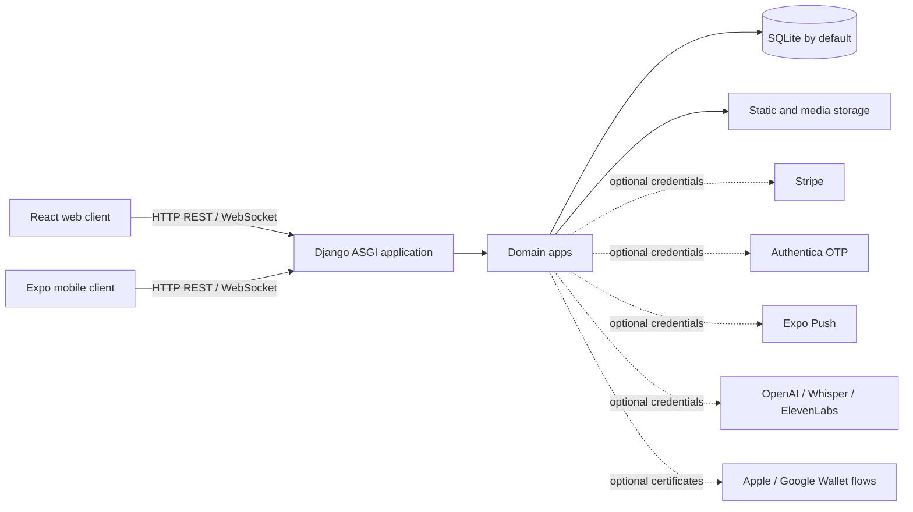

# CafeMS architecture

## Scope

This document describes the implementation represented in the showcase repository. It does not describe private production infrastructure. The repository contains the application source and migrations, but no operational database or credentials.

## Runtime shape

The Docker Compose file provisions PostgreSQL and Redis containers for a fuller deployment shape, but the current Django settings select SQLite and `channels.layers.InMemoryChannelLayer`. A reviewer should therefore treat PostgreSQL and Redis as provisioned infrastructure examples, not as active integrations in the default application settings.

## Backend

The backend is a Django 5.2.8 project served through WSGI/ASGI. Django REST Framework provides authenticated API endpoints, filtering, search, ordering, throttling, and serializer-based validation. Daphne is used by the Compose command to serve the ASGI application. Django Channels routes support and order WebSockets.

The domain is split into Django apps:

- `accounts`: custom users, JWT login/refresh, verification, addresses, push tokens, activity, and role permissions.
- `products`: categories, subcategories, products, add-ons, and menu import commands.
- `orders`: orders, order items, tables, POS operations, inventory adjustments, status history, and public tracking.
- `invoices`: invoice records and PDF/barcode/QR generation.
- `payments`: payment methods and transaction records; Stripe checkout/webhook views live with order payment flows.
- `support`: authenticated and guest conversations, rule-based bot handling, staff activity, voice messages, and WebSocket consumers.
- `hr`: employees, attendance, leave, contracts, payroll, documents, reports, and notifications.
- `accounting`: chart of accounts, journal entries, suppliers, bank accounts, expenses, purchase orders, assets, tax records, reports, and inventory transactions.
- `loyalty`: loyalty profiles and transactions, settings, scanning, and wallet-pass flows.
- `store`: runtime branding and contact settings.
- `contact` and `core`: contact messages and health checks.

## Clients

The web client is React 18 with TypeScript, Vite, Tailwind CSS, React Router, Axios, Framer Motion, Recharts, and Stripe.js. It includes public ordering flows and authenticated dashboards for operations, accounting, HR, store settings, support, and reporting.

The mobile client is React Native with Expo SDK 54. It uses React Navigation, TanStack React Query, Axios, SecureStore/AsyncStorage, notifications, WebView, media/audio features, bilingual copy, and RTL-aware screens.

## Authentication and authorization

The API uses a custom user model with SimpleJWT access and refresh tokens. The code includes identifier-based login, password reset, email/phone verification, authenticated support, and permission/role endpoints. Dashboard and HR/accounting operations are protected through DRF authentication and application-level permission checks.

## Realtime and integrations

The ASGI application exposes support and order WebSocket routes. The default channel layer is in-memory, which is suitable for local evaluation but does not provide multi-process persistence. Optional integrations are disabled until their environment variables and certificates are configured: Stripe, Authentica OTP, Expo Push, Apple/Google Wallet, OpenAI/Whisper, and ElevenLabs.

## Data and storage boundaries

Migrations remain part of the source because they describe the schema evolution. Database files, backups, exports, private uploads, environment files, and generated build artifacts are excluded from the showcase history. A clean local SQLite database is created by `python manage.py migrate`.

## Deployment files

The repository includes backend and frontend Dockerfiles plus a Compose definition. The Compose definition starts database, Redis, backend, and frontend services, while the application defaults documented above remain the source of truth for the current configuration.
