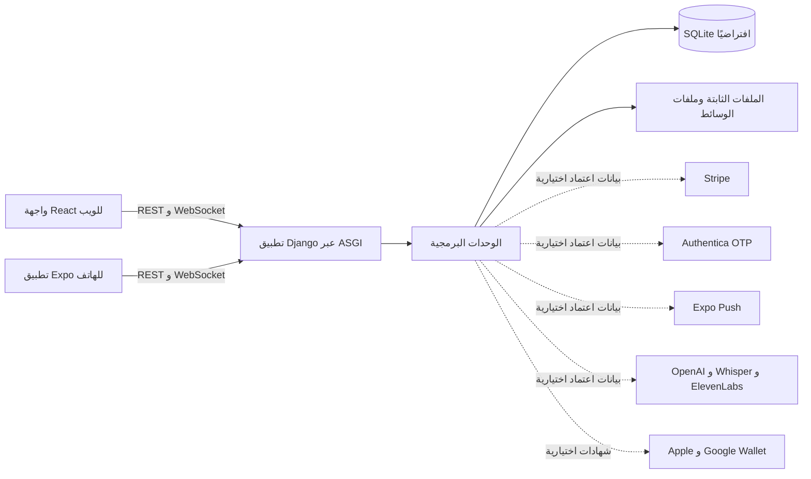

# معمارية CafeMS

## نطاق الوثيقة

تشرح هذه الوثيقة التطبيق الموجود في نسخة العرض العامة. لا تصف البنية الخاصة ببيئة الإنتاج. يتضمن المستودع الشيفرة المصدرية وملفات migrations، ولا يتضمن قاعدة بيانات تشغيلية أو بيانات اعتماد.

## الشكل التشغيلي

ينشئ Docker Compose حاويات PostgreSQL وRedis لتصور نشر أوسع، لكن إعدادات Django الحالية تستخدم SQLite و`channels.layers.InMemoryChannelLayer`. لذلك يجب اعتبار PostgreSQL وRedis خدمات موفرة في ملف Compose وليستا موصولتين فعليًا بإعدادات التطبيق الافتراضية.

## الخلفية

الخلفية مبنية على Django 5.2.8 وتعمل عبر WSGI/ASGI. يوفر Django REST Framework واجهات API محمية بالمصادقة، مع التصفية والبحث والترتيب وتحديد المعدل والتحقق عبر serializers. يستخدم أمر Compose خادم Daphne لتشغيل ASGI، وتوجه Django Channels اتصالات الدعم والطلبات عبر WebSocket.

الوحدات الرئيسية هي:

- `accounts`: المستخدمون المخصصون، JWT، تسجيل الدخول والتحديث، التحقق، العناوين، رموز الإشعارات، النشاط والصلاحيات.
- `products`: التصنيفات والمنتجات والإضافات وأوامر استيراد القائمة.
- `orders`: الطلبات والعناصر والطاولات ونقاط البيع والمخزون وسجل الحالات والتتبع العام.
- `invoices`: الفواتير وإنشاء PDF والباركود وQR.
- `payments`: طرق الدفع والمعاملات وتدفقات Stripe المرتبطة بالطلبات.
- `support`: محادثات المستخدمين والضيوف، بوت قائم على القواعد، نشاط الموظفين، الرسائل الصوتية وWebSocket.
- `hr`: الموظفون والحضور والإجازات والعقود والرواتب والوثائق والتقارير والإشعارات.
- `accounting`: دليل الحسابات والقيود والموردون والحسابات البنكية والمصروفات وأوامر الشراء والأصول والضرائب والتقارير وحركات المخزون.
- `loyalty`: ملفات الولاء والمعاملات والإعدادات والمسح وتدفقات بطاقات المحفظة.
- `store` و`contact` و`core`: إعدادات العرض والاتصال وفحوصات الصحة.

## الواجهات

واجهة الويب مبنية على React 18 وTypeScript وVite وTailwind CSS وReact Router وAxios وFramer Motion وRecharts وStripe.js. تشمل الطلب العام ولوحات العمليات والمحاسبة والموارد البشرية والدعم وإعدادات المتجر والتقارير.

تطبيق الهاتف مبني على React Native وExpo SDK 54، ويستخدم React Navigation وTanStack React Query وAxios وSecureStore/AsyncStorage والإشعارات وWebView وميزات الصوت والصور ونصوصًا ثنائية اللغة مع دعم RTL.

## المصادقة والتكاملات

يستخدم API نموذج مستخدم مخصصًا مع SimpleJWT لرموز الوصول والتحديث. يتضمن الكود تسجيل الدخول بالمعرف، استعادة كلمة المرور، التحقق من البريد والهاتف، الدعم الموثق، ونقاط نهاية للصلاحيات والأدوار. التكاملات الخارجية اختيارية ولا تعمل دون متغيرات البيئة والشهادات المناسبة، وتشمل Stripe وAuthentica وExpo Push وApple/Google Wallet وOpenAI/Whisper وElevenLabs.

## حدود البيانات والنشر

تبقى ملفات migrations لأنها تصف تطور المخطط. أما قواعد البيانات والنسخ الاحتياطية والتصديرات والوسائط الخاصة وملفات البيئة ومخرجات البناء فمستبعدة من تاريخ نسخة العرض. ينشئ `python manage.py migrate` قاعدة SQLite محلية نظيفة. ويتضمن المستودع Dockerfiles وملف Compose مع ملاحظة حدود الاتصال الموضحة أعلاه.
